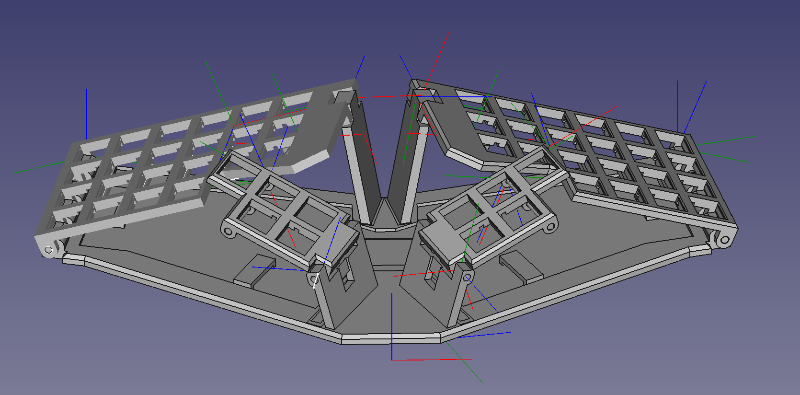

# WIP

4x6 mod of Btrfld

# Btmnfld

Pronounced "batmanfold".
Much credit to original creator Solidhal: https://github.com/SolidHal/btrfld

## Features common to original btrfld
- 5 key dactyl-manuform-mini thumb cluster
- flat, tented qwerty keys
- folds flat for portability

## Alterations from original btrfld
- Main body has an extra colum (pseudo 4x6)
- Less tenting (22 deg vs. 32 in original)
- No wireless - Elite C for MCU (wiring usb directly to pcb)
- Somewhat hidden wiring under the "bat"
- Using threaded 3mm steel rod instead of smooth (fixed with washers and nuts)
- Magnetic latches for keeping the board folded

## Parts:

- USB C breakout basic breakout board 
  - Used this one https://let-elektronik.dk/shop/950-stik-breakout/15100--usb-c-breakout/

- choc v1 keyswitches

- diodes

- 3mm diameter threaded steel rod

- 1.27mm flat ribbon cable

- 1x Elite C
  
- 3d printed pieces, located in the STLs folder

- 50x1 mm circular magnetic bottom plate (optional)
  - I used one i had lying around: https://thestick.company/product/imsticker/ (the medium size)

- Four 6x4x2 mm neodymium magnets

- One circular 4x1 mm neodymium magnet

- Glue for magnets (mostly held by 3d structure)

## Modifying
Edit `btmnfld.FCStd` using FreeCad.
I am by no means a FreeCad expert, so I'm sure its built suboptimally.
Expect slow working with the files bc. of the many crude edits.
Should anyone want to do alterations i would advice simply "building on top" instead of going back the chain of events to prevent having to remap all skethces and external geometry (i did that and it took forever...). See https://wiki.freecadweb.org/Topological_naming_problem

## Print Settings:
```
Supports on buildplate
Detect Bridging
100% infill
0.20mm
PLA/PETG
```

## Assembly Tips:

- Must trim a very very slight amount off of the center pin on keyswitches over the body/thumbcluster rod
  - switch above this must be rotated to give clearance for the rod locker

- Thumb cluster end of rod gets glued in place

- Reference the images in the "BuildPictures" folder


## Future development
- Underglow?
